# Diagramas de secuencia — mapeo RF → código actual

Referencia para diseñar test cases (Vitest, lado frontend). Cada bloque: qué RF cubre, en qué archivo(s)/función(es) vive HOY (no como se implementó originalmente), diagrama de secuencia en PlantUML (notación `actor`/`boundary`/`control`/`entity`/`database`), y notas de qué es testeable como función pura vs qué necesita React/Redux/red.

**Cancelados, sin código:** RF47 (Añadir venta), RF48 (Eliminar venta), RF49 (Modificar venta).

## Convención de estereotipos usada en todos los diagramas

| Estereotipo | Qué representa aquí | Ejemplos |
|---|---|---|
| `actor` | La persona usando la app | Usuario |
| `boundary` | Lo que toca el actor directamente, o el borde HTTP del worker (el punto donde algo externo entra al sistema) | componentes `.jsx`, `*.route.js` del worker |
| `control` | Orquestación/lógica de negocio — coordina, no es UI ni es el dato en sí | hooks (`use*.js`), Context (`StagingContext`), `*.controller.js`/`*.usecase.js`/`*.service.js` del worker |
| `entity` | Función pura de cálculo o estructura que representa datos del dominio | `costCalculations.js`, `financialEvaluation.js`, `outflowCalculations.js`, `*.model.js` del worker, reducers de `EditableTableSlice` |
| `database` | Almacenamiento real | D1, R2, `localStorage` |

---

## A. RF00 — Subir Programa de proyectos

Full-stack.

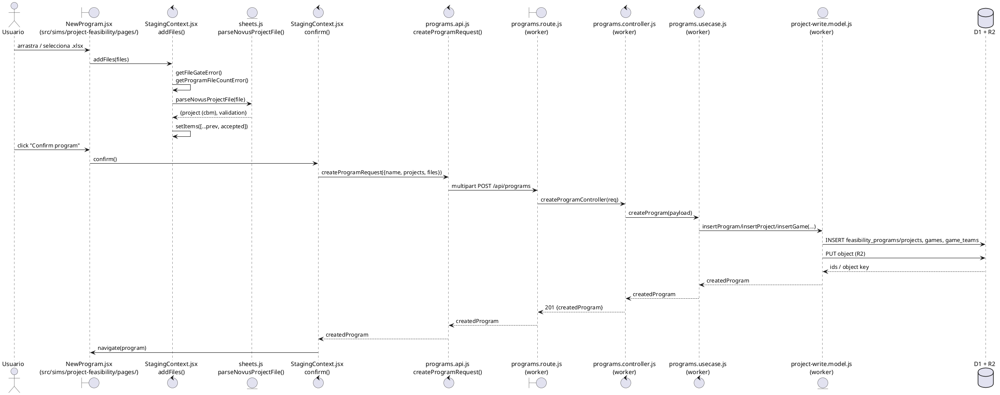

**Testeable puro (sin DOM):** `getFileGateError`, `getProgramFileCountError`, `validateProgram` (gate/validation logic), y las funciones de `sheets.js` que arma `parseNovusProjectFile` (`readInversion`, `readPremisas`, `readCOs`, etc.) — dales un array-de-arrays simulando una hoja y afirma el `cbm` resultante.
**Necesita mocks:** `ApiClient` (red), todo lo del lado worker (fuera de alcance de Vitest frontend).

---

## B. RF42/RF43 — Tabla de gastos / Tabla de precios

Frontend-only, read-only render (no add/remove/edit — estas nunca tuvieron CRUD, son una fila fija por año).

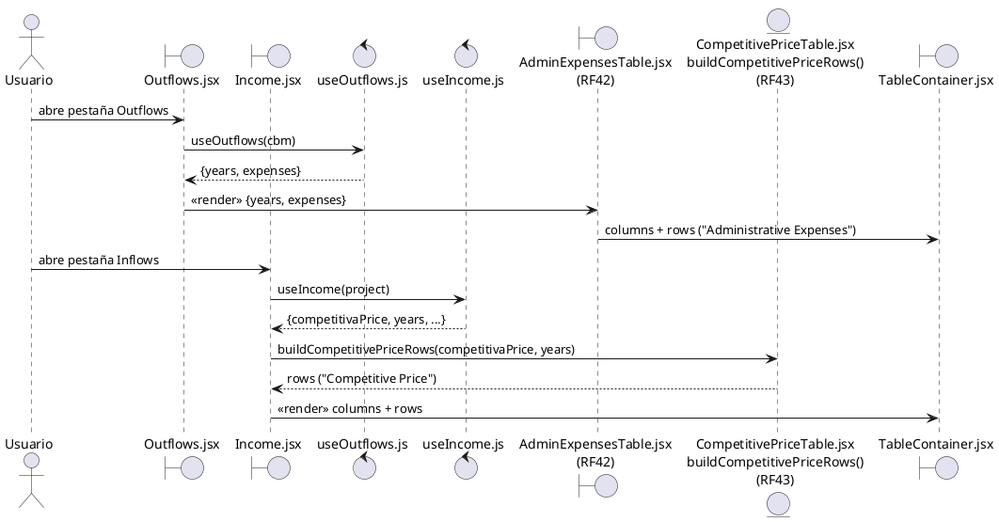

**Testeable puro:** `buildCompetitivePriceRows(competitivaPrice, years)` — input array indexado por offset de año, output shape exacto. Mismo patrón para `buildProductionCostRows`, `buildSalesRows`, `buildUtilityCostRows` (todas en `src/components/sims/program/income/*.jsx`, exportadas como funciones `entity`-puras `rows = build*(data, years)`).

---

## C. RF44/45/46 — Estimación de ventas, edición, ventas netas

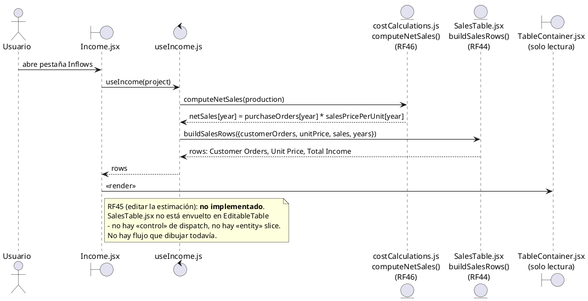

**Testeable puro:** `computeNetSales(production)` (`src/utils/dashboard/costCalculations.js:114`) — verificar que coincide llamado desde `useIncome.js` (RF44/Inflows) Y desde `buildCostOfSales.js` (Income Statement) con el mismo input, ya que ambos caminos deben coincidir.

---

## D. RF50-53 — Crear/Añadir/Eliminar/Modificar tabla de costos

⚠️ UI deshabilitada (`EditableTable.jsx` → `ROWS_EDITABLE = false`), pero el pipeline Redux→API→D1 funciona si lo invocas directo (sin pasar por click).

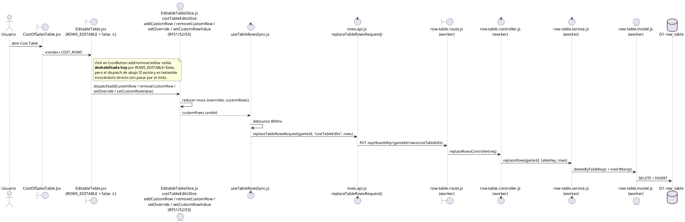

**Testeable puro:** los reducers de `EditableTableSlice.js` directo (sin montar React) — `addCustomRow`, `removeCustomRow`, `setOverride`, `setCustomRowLabel`, `setCustomRowValue`, y `effectiveTotal(state, rows, getValue, year)`. Esto es Redux Toolkit puro (`entity`), perfecto para Vitest sin DOM.
**Necesita mocks:** `ApiClient` (red) si quieres probar el debounce/PUT.

---

## E. RF54/55/56 — Utilidad bruta / operación / antes de impuestos

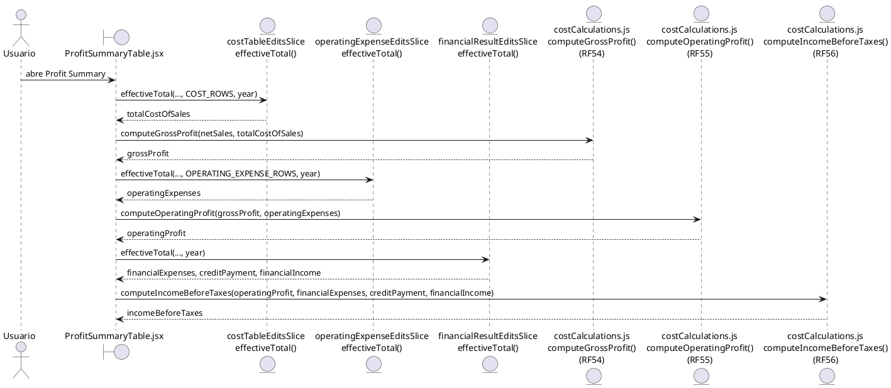

**Testeable puro:** `computeGrossProfit`, `computeOperatingProfit`, `computeIncomeBeforeTaxes` (`src/utils/dashboard/costCalculations.js:249/395/503`) — funciones de aritmética simple (`entity`), casos límite: negativos, cero ventas, gastos mayores a ventas.
**Necesita Redux:** el "live recompute" en `ProfitSummaryTable.jsx` que lee los 3 slices — ahí sí monta un store de prueba o testeas `effectiveTotal` por separado (igual que en el bloque D).

---

## F. RF57/58 — Añadir/Eliminar impuesto

✅ Única excepción viva en la UI (no pasa por `ROWS_EDITABLE`).

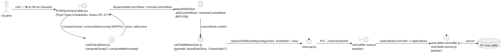

**Testeable puro:** `computeTaxes`, `computeNetIncome` (`costCalculations.js:517-543`), más los reducers del `taxesEditsSlice` igual que bloque D.

---

## G. RF63/64 — Tabla de flujo de efectivo / Tabla de salidas

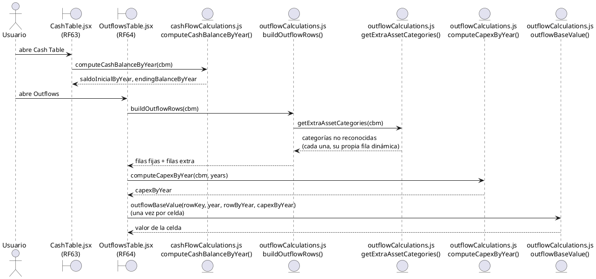

**Testeable puro:** `computeCashBalanceByYear`, `buildOutflowRows`, `getExtraAssetCategories`, `computeCapexByYear`, `outflowBaseValue` — todas `entity` puras en `src/sims/project-feasibility/costTable/{cashFlowCalculations,outflowCalculations}.js`, cero dependencia de React. Casos clave ya conocidos de esta sesión: doble conteo de maquinaria, exclusión de categorías conocidas.

---

## H. RF65/66/67 — TREMA / TIR / Decisión

Las 3 son funciones puras en `src/utils/dashboard/financialEvaluation.js`, literalmente comentadas con su RF.

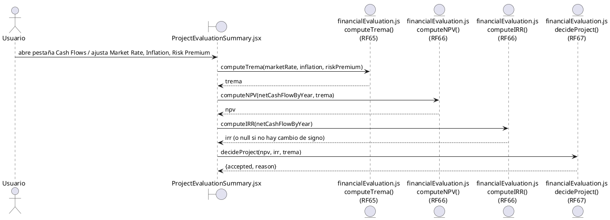

**Testeable puro, prioridad alta:** `computeTrema`, `computeNPV`, `computeIRR` (bisección, probar: serie sin cambio de signo → `null`; serie con VAN negativo en todo el rango; convergencia con tolerancia), `decideProject` (3 casos: IRR null, npv>0&&irr>trema, lo contrario).
⚠️ Nota de `CALCULOS_Y_MONEDA.md`: la serie que hoy alimenta a estas funciones (`endingBalanceByYear`, saldo acumulado) no es la que el Excel de referencia usa (Flujo Neto del periodo) — bug conocido sin arreglar. Vale la pena escribir el test ANTES del fix fijando el comportamiento actual, o directo con el valor esperado del Excel si van a arreglarlo ya.

---

## I. RF68 — Gráfica de flujo neto de efectivo

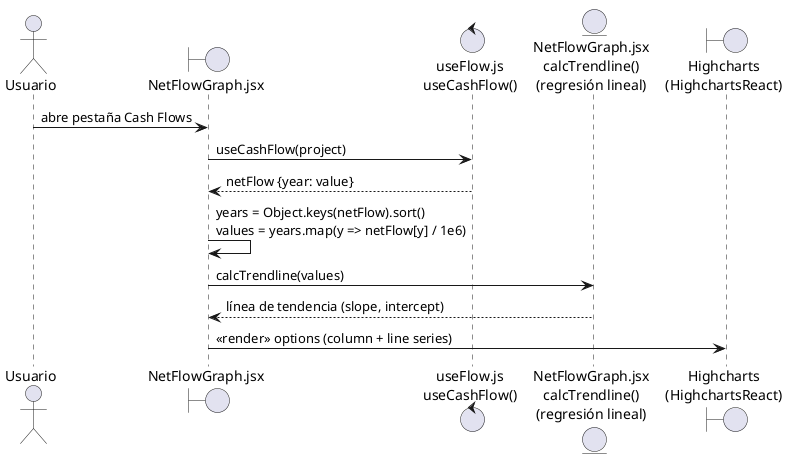

**Testeable puro:** `calcTrendline(values)` (`entity`, regresión lineal simple, está en el mismo archivo) — dale una serie conocida y verifica slope/intercept. El render de Highcharts no es útil probarlo en Vitest (sería snapshot frágil).

---

## J. RF69-74 — Balance General (Activos circulantes, Fijo, Diferido, Pasivo circulante, Pasivo LP, Capital, Razones)

Un solo diagrama porque todos comparten el mismo `control` central.

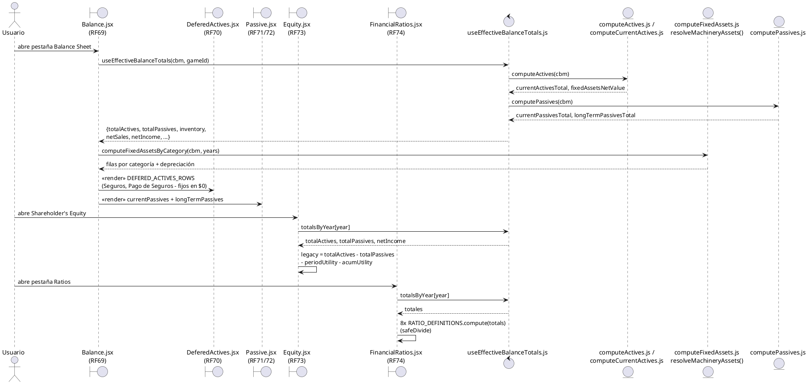

**Testeable puro:** `computeActives`, `computeCurrentActives` (ojo: `stocks`/`inventary`/`deposits` son **mock hardcodeado**, no leen del cbm — documentar eso en el test, no esperar que cambie con el Excel), `computeFixedAssets.js` (`resolveMachineryAssets`, `rateFieldForCategory`), `computePassives.js`. Los 8 `RATIO_DEFINITIONS.compute` de `FinancialRatios.jsx` son funciones `entity` puras `(totals) => number` — tabla perfecta para tests parametrizados (un caso por ratio × signo del denominador: positivo, negativo, cero→NaN→"—").
**Necesita Redux:** `useEffectiveBalanceTotals` (`control`) lee 4 slices (`currentActivesSlice`, `deferedActivesSlice`, `currentPassiveSlice`, `longTermPassiveSlice`) — para testear el hook completo monta un store de prueba con overrides/customRows conocidos.

---

## K. R76/RF76 — Iniciar sesión

Full-stack, dos sistemas de sesión en paralelo (JWT propio + Clerk).

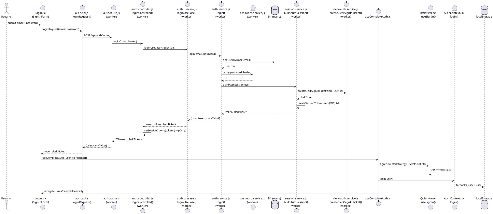

**Fuera de alcance de Vitest frontend puro:** casi todo este flujo depende de red (worker) y de Clerk SDK — candidato a mock pesado (`vi.mock` de `auth.api.js` y `@clerk/react`) más que unit test real. Lo único puramente testeable sin mocks: validación de formulario en `Login.jsx` si la tiene (revisar), y el reducer `entity` de `AuthContext.jsx` (`login`/`logout`, lectura/escritura de `localStorage`).
**Nota de seguridad:** `session.middleware.js` solo debe disparar logout en código `session_invalid`, nunca en 401 genérico — ya hay un test implícito ahí (`isSessionInvalidError` en `worker.util.js`), vale la pena un test explícito de esa función con los 2 casos (401 con código vs 401 sin código).
