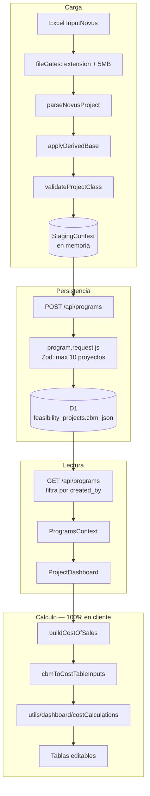

# Project Feasibility Simulation — guía completa

> Documento de análisis de TecBooks V2, con foco en la feature
> `src/sims/project-feasibility/`. Cubre el panorama general del repo, la
> arquitectura y flujo de datos de la feature, el modelo financiero fórmula
> por fórmula, y cómo extenderla.
>
> Complementa —no reemplaza— a
> [`../app_architecture/NEW_PROJECT_STRUCTURE.md`](../app_architecture/NEW_PROJECT_STRUCTURE.md)
> (mapa de carpetas del refactor) y
> [`../diagrams/CBM_WORKFLOW.md`](../diagrams/CBM_WORKFLOW.md)
> (pipeline del Canonical Business Model del dashboard).

---

## 1. Panorama general

TecBooks V2 es un **simulador financiero educativo**. La idea central: cualquier
fuente de datos de negocio (plantilla Excel llena, cuestionario, simulador) se
normaliza a un único modelo interno —el **Canonical Business Model (CBM)**— y a
partir de ahí se derivan estados financieros, métricas de inversión y
proyecciones.

```
Input (Excel / builder / sim) ──► Adapter ──► CBM ──► Cálculo ──► UI
```

### Stack

| Capa | Tecnología |
|---|---|
| Frontend | React 19 + Vite 7, SPA pura (no Next.js, no SSR). **JavaScript, sin TypeScript.** Alias `@/* → src/*` en `jsconfig.json` |
| Routing | `react-router-dom` 7 con sub-routers por dominio |
| Estilos | Tailwind 3.4 + shadcn/ui (*new-york*, slate) + MUI 7 + Emotion/styled-components + ~14 hojas CSS globales |
| Estado | Redux Toolkit (stores **por feature**, no global) + React Context + React Query (solo 2 archivos) + `sessionStorage` |
| Gráficas | Chart.js, Recharts, Highcharts y FusionCharts — las cuatro |
| Excel | SheetJS (`xlsx`) y ExcelJS |
| Auth | Clerk (`@clerk/react`) en front; `@clerk/backend` + JWT propio en el worker |
| Backend | Cloudflare Workers + Hono 4 + **D1** (SQLite). Sin ORM: SQL crudo con `db.prepare().bind()` |
| Deploy | Cloudflare Pages (`tecbooks-frontend[-develop]`) + Workers, vía Wrangler |

### Tres generaciones de código conviviendo

Es el hallazgo estructural más importante para orientarse en el repo:

| Generación | Dónde | Estado |
|---|---|---|
| **Legacy** | `src/MxRep/` (~40% del código) | App educativa multi-rol (SuperAdmin / Admin / Professor / Student) con su **propio** AuthContext, routing, servicios y backend externo. Isla deliberada, documentada como tal |
| **Media** | `src/pages/dashboard/`, `src/adapters/`, `src/utils/dashboard/`, `src/models/canonical-business-model/` | El dashboard CBM del refactor. Funciona, pero **no persiste nada**: el CBM viaja por `sessionStorage` y se pierde al cerrar la pestaña |
| **Actual** | `src/sims/project-feasibility/` + `worker/` | La única feature con **backend real, autenticación y persistencia en D1**. Aquí ocurre todo el desarrollo reciente (PRs #10–#16) |

Las tres comparten `src/utils/dashboard/` como biblioteca de fórmulas, que es lo
que evita que la matemática se duplique del todo.

---

## 2. Distribución de carpetas

### Primer nivel

| Carpeta / archivo | Propósito |
|---|---|
| `src/` | SPA React completo |
| `worker/` | Backend Hono/Workers + migraciones D1 + seeds |
| `documentation/` | Arquitectura, lógica de negocio, diagramas PlantUML por requisito (RF50, RF76, TaxesTable) |
| `public/` | Estáticos: `imgs/`, plantillas descargables |
| `.github/workflows/` | Un solo workflow, `deploy-dev.yml`, que únicamente dispara un webhook por `curl` al pushear a `develop` |
| Raíz | Configs (`vite`, `tailwind`, `postcss`, `eslint`, `components.json`, `jsconfig`), `README.md`, `DESIGN.md` (auditoría honesta del design system), `db.config.txt` (ER en Mermaid del modelo **legacy de MxRep**, no del D1 actual) y tres `.xlsx` de trabajo comiteados |

### `src/` — segundo nivel

| Carpeta | Propósito |
|---|---|
| `pages/` | Pantallas top-level (`HomePage`, `Login`, `FAQ`, `TemplateSelector`, `TemplateUpload`, `CustomExcelBuilder`) + subcarpetas `dashboard/` y `sims/` |
| `models/canonical-business-model/` | **El núcleo del dominio.** Factory (única forma aprobada de construir un CBM), validators, operations, barrel `index.js` |
| `adapters/` | Traducen fuentes externas → CBM. Activos: `excel/mexico-manufacturing.adapter.js` (si hay hoja `Welcome`) y `excel/excel.adapter.js` (fallback). `custom-excel/` y `mxrep/` son stubs no cableados |
| **`sims/project-feasibility/`** | La feature de este documento. Módulo autocontenido: `parse/`, `model/`, `costTable/`, `pages/`, `api/`, `hooks/`, `staging/` |
| `components/` | UI por dominio: `ui/` (shadcn), `global/` (sidebar, dropzone, **`EditableTable`**), `dashboard/` (las tablas del estado de resultados), `sims/`, `home/`, `faq/`, `custom-excel/` |
| `contexts/` | `dashboardContext`, `AuthContext`, `NavigationContext`, `PortraitContext`, `LegacySimDataContext` |
| `store/` | Stores Redux **independientes por feature** + `EditableTableSlice.js`, una fábrica de slices reutilizable |
| `utils/` | Fórmulas puras: `dashboard/` (`costCalculations`, `statements`, `derivations`, `evaluations`, `projectMetrics`), `sims/`, `number.utils.js` |
| `hooks/`, `config/`, `api/`, `styles/`, `assets/`, `tours/` | Hooks por feature; constantes de negocio (países, premisas, prestaciones); clientes HTTP y generación de plantillas; CSS global; imágenes; tours con `driver.js` |
| `MxRep/` | Módulo legacy aislado, con su propio `Routing/`, `Views/`, `Forms/`, `Components/` y `utils/` |

### `worker/src/` — la capa más disciplinada del repo

```
routes/ ──► controllers/ ──► usecases/ ──► services/ ──► models/ (SQL)
              │                                            │
        requests/ (Zod)                              mappers/ (row → DTO)
        middleware/ (session, logger, error-handler)
```

Es el patrón a imitar para cualquier endpoint nuevo. `migrations/` guarda las
migraciones `.sql` numeradas, aplicadas con `wrangler d1 migrations apply`.

---

## 3. Prácticas de desarrollo

| Área | Cómo está hoy |
|---|---|
| **Lenguaje** | JS/JSX puro (149 `.js` + 330 `.jsx`, cero `.ts`). Tipado solo por JSDoc ocasional |
| **Naming** | Componentes/contexts `PascalCase.jsx`; módulos no-React kebab-case con sufijo de rol (`*.adapter.js`, `*.factory.js`, `*.config.js`, `*.store.js`, `*.service.js`). MxRep usa su propio esquema con directorios PascalCase |
| **Estado** | Cuatro sistemas coexistiendo: Context, Redux por feature, React Query (solo `App.jsx` y `Expenses.jsx`) y `sessionStorage` como transporte del CBM |
| **Estilos** | Cuatro capas simultáneas (Tailwind, shadcn, MUI, CSS global). `DESIGN.md` ya documenta la inconsistencia: siete azules distintos compitiendo con el Navy de marca `#073a5a` |
| **Errores** | Un solo Error Boundary en todo el front; ~36 `alert()` como UI de error. En el worker sí hay patrón limpio (`error-handler.middleware.js`) |
| **Testing** | Prácticamente inexistente: no hay framework instalado ni script `test`. El único test es `src/utils/sims/forecasts/__tests__/forecaster.test.mjs`, ejecutable a mano — y sus helpers son **copias** del código de producción, así que puede pasar mientras el original está roto |
| **Lint / format** | ESLint 9 flat config funcionando (`npm run lint`). Prettier instalado pero **sin configuración ni script**, y `eslint-config-prettier` no aplicado |
| **CI** | No corre lint, build ni tests en PRs. El único workflow dispara un webhook |
| **Git** | Git Flow simplificado: `main` ← `develop` ← ramas de feature, siempre vía PR. Conventional Commits mayormente respetados, con desviaciones (`feature:`, `merge:`) y mezcla español/inglés |

---

## 4. Project Feasibility Simulation — arquitectura y flujo de datos

### 4.1 Qué hace

El usuario sube uno o varios Excel **InputNovus** (hasta 10 por programa); la
app los parsea, valida y guarda, y sobre cada proyecto despliega un dashboard
financiero con tablas editables: costo de ventas, gastos de operación,
resultado financiero, impuestos, utilidad neta, flujo de efectivo y punto de
equilibrio.

### 4.2 Mapa de la carpeta

| Capa | Archivos |
|---|---|
| Constantes | `constants.js` — horizonte **fijo 2025–2035**, 7 hojas obligatorias, límites de archivo (5 MB, 10 proyectos) |
| Parseo | `parse/parseNovusProject.js`, `parse/sheets.js` (Premisas, COs, Capacidad, BOM, Inversion, Empleados_2, Servicios), `parse/cells.js`, `parse/fileGates.js` |
| Modelo | `model/createProjectClass.js` (esquema vacío), `model/applyDerivedBase.js` (derivados), `model/validateProjectClass.js`, `model/programExtractors.js` |
| Cálculo | `costTable/buildCostOfSales.js` (**orquestador**), `costTable/cbmToCostTableInputs.js` (adaptador), `costTable/outflowCalculations.js` (CAPEX + salidas de caja) |
| UI de tablas | `costTable/ProjectCostSummary.jsx`, `ProfitSummary.jsx`, `CashTable.jsx`, `OutflowsTable.jsx`, `BreakEvenSummary.jsx`, `BreakEvenChart.jsx` |
| Páginas | `pages/ProgramsPortal.jsx`, `ProgramsWorkspace.jsx`, `ProgramsSidebar.jsx`, `NewProgram.jsx`, `ProjectDropzone.jsx`, `ProjectDashboard.jsx`, `RequireAuth.jsx`, `ProgramsContext.jsx` |
| Carga | `staging/StagingContext.jsx` |
| API | `api/programs.api.js` |

**Fuera de la carpeta, pero esencial:**

- `src/utils/dashboard/costCalculations.js` — **el motor de fórmulas puras** (298 líneas). Todo el modelo financiero vive aquí.
- `src/components/global/EditableTable.jsx` + `src/store/EditableTableSlice.js` — infraestructura de tablas editables.
- `src/components/dashboard/{CostOfSalesTable,OperatingExpensesTable,FinancialResultTable,ProfitSummaryTable}.jsx` — los componentes de tabla.
- `worker/` — migración `0007_feasibility_programs.sql` y la cadena `programs.route → controller → usecase → service → model → mapper`.

### 4.3 Pipeline end-to-end



### 4.4 Rutas y árbol de componentes

`src/App.jsx` monta `/sims/project-feasibility/*` →
`src/pages/sims/ProjectFeasibility.jsx`:

| Sub-ruta | Componente | Auth |
|---|---|---|
| `programs` | `ProgramsPortal` (listado) | `RequireAuth` |
| `programs/new` | `NewProgram` + `StagingProvider` | `RequireAuth` |
| `programs/:programId/:projectId` | `ProjectDashboard` | `RequireAuth` |
| `expenses` | `Expenses` | **ninguna** |

```
ProgramsWorkspace ── ProgramsProvider (GET /api/programs) + ProgramsSidebar
└── ProjectDashboard      tabs: Balance | Ratios | Cash Flow | Income Statement
     ├─ Ratios      → ProjectCostSummary → CostOfSalesTable
     │                ProfitSummary      → OperatingExpensesTable
     │                                   → FinancialResultTable
     │                                   → ProfitSummaryTable  (read-only, derivada)
     │                BreakEvenSummary   → BreakEvenChart
     ├─ Cash Flow   → CashTable + OutflowsTable
     └─ Balance / Income Statement → mock "under construction"
```

Detalle a corregir: **el estado de resultados sí está calculado, pero vive en el
tab _Ratios_**; el tab _Income Statement_ es un mock.

### 4.5 Qué se persiste vs qué se calcula

**En D1** (`worker/migrations/0007_feasibility_programs.sql`):

```sql
feasibility_programs (id, name, created_by → users, created_at)
feasibility_projects (id, program_id, name, cbm_json TEXT NOT NULL)
```

Es decir: **solo el CBM crudo parseado del Excel, serializado como JSON en una
columna**. Diseño deliberadamente desacoplado del sistema de juegos —el
comentario de la migración lo justifica: la tabla `projects` exige una
inversión `NOT NULL` que aquí no aplica.

- `POST /api/programs` valida con Zod, pero `cbm` es `z.record(z.string(), z.any())`: **el CBM no se valida estructuralmente en el backend**. Toda la validación real ocurre en el cliente (`validateProjectClass.js`).
- `GET /api/programs` filtra por `created_by = userId` (multi-tenancy a nivel usuario).
- **No existen** `GET /:id`, `PUT` ni `DELETE` expuestos.

**En cliente, 100%:** costo de ventas, depreciación, gastos, financiamiento,
impuestos, flujo de caja y punto de equilibrio.

**Nada de las ediciones se persiste.** Los overrides y filas personalizadas
viven en un store Redux creado por proyecto que se destruye al navegar o
refrescar. No hay `localStorage`, ni `redux-persist`, ni endpoint de guardado.
**Es la brecha funcional más grande de la feature** (receta para cerrarla en
§6.3).

### 4.6 El sistema de tablas editables

`src/store/EditableTableSlice.js` es una fábrica de slices. Cada slice guarda:

- `overrides`: mapa con clave `"rowKey:columnKey"` → valor editado a mano.
- `customRows`: filas añadidas por el usuario, con id de `nanoid`.

Y expone `effectiveTotal(state, rows, getValue, column)`, que suma la columna
respetando overrides y filas custom. Ese selector es lo que hace que **una
edición se propague en vivo entre tablas hermanas**: `ProfitSummaryTable` es
puramente derivada —lee los cuatro slices y recalcula utilidad bruta, operativa,
antes de impuestos y neta— así que editar una celda del Cost Table mueve Net
Income al instante.

`ProjectDashboard.jsx` crea un store nuevo por proyecto (`useMemo` con
dependencia `project?.id`) registrando **seis** slices independientes:
`costTableEdits`, `operatingExpenseEdits`, `financialResultEdits`, `taxesEdits`,
`cashFlowEdits`, `outflowEdits`. Son separados a propósito: una fila custom
añadida a una tabla no debe sumarse al total de otra.

Interacción: doble clic en celda para editar (Enter/blur confirma, Escape
cancela), hover para añadir/eliminar filas, chevron en la fila de total para
desplegar el desglose o la fórmula en texto.

---

## 5. El modelo financiero, paso a paso

Todas las fórmulas puras están en `src/utils/dashboard/costCalculations.js`;
`buildCostOfSales.js` las orquesta. Los comentarios del código referencian los
requisitos formales (RF-50, RF-54…RF-57, RF-63) y las celdas de la plantilla
original.

### 5.0 Inputs — del Excel al CBM

`parse/parseNovusProject.js` lee 7 hojas obligatorias (`constants.js`):

| Hoja | Qué aporta |
|---|---|
| **Premisas** | Series por año 2025–2035: inflación nacional, ISR, PTU, % costo indirecto de producto, % gasto de venta, % administración, tasas de depreciación (edificios / maquinaria / transporte / cómputo), tasa líder nacional, CPP, CETES, LIBOR. También `timeline.financingPeriods` (fila "Periodos") |
| **COs** | `yearZeroYear`, `yearZeroTotal`, `monthShares`, `yearZeroOrders`, histórico |
| **Capacidad** | `capacity.line` (quality yield, segundos/unidad, horas/turno, turnos, líneas, días/semanas/meses) y `capacity.machines[]` con `acquisitionByYear` |
| **BOM** | `salePrice` (celda "Costo de venta") y `parts[] {quantity, cost}` |
| **Inversion** | `assets.buildings / transport / compute[]` con `acquisitionByYear` |
| **Empleados_2** | Percepción, IMSS, INFONAVIT, vales, prima vacacional, aguinaldo, fondo de ahorro, comedor, ISR, cantidad |
| **Servicios** | Se parsea pero **no se consume en ningún cálculo** todavía |

### 5.1 Derivados — `model/applyDerivedBase.js`

```js
unitsPerHour   = 3600 / secondsPerUnit
annualCapacity = unitsPerHour * hoursShift * shifts * productionLines
                 * weekWorkingDays * monthsWorkingWeeks * yearWorkingMonths

bomMaterialCost = Σ (part.quantity * part.cost)

benefitsTotal    = percepcion * (imss + infonavit + vales + primaVacacional
                                 + aguinaldo + fondoAhorro + comedor)
salarioIntegrado = percepcion + benefitsTotal
```

El ISR del empleado se excluye a propósito: es retención, no costo patronal —
así lo hace también la columna "Salario Integrado" de la plantilla.

**Clasificación de empleados** por prefijo del nombre:

| Regla | Categoría |
|---|---|
| Nombre empieza con `MOD ` | `direct` (mano de obra directa) |
| Nombre empieza con `MOID ` | `indirect` |
| Nombre empieza con `IM ` o contiene `INGENIERO`, o es `GERENTE DE OPERACIONES` | `engineering` |
| Tipo `administracion` | `administrative` |
| Tipo `operacion` | `indirect` |
| Cualquier otro | `null` → se reporta en `unclassifiedEmployees` y **no entra a ningún total** |

### 5.2 Proyección de la demanda — `cbmToCostTableInputs.js`

Simplificación documentada y clave para entender los números: InputNovus solo
trae **un dato real**, el total de órdenes del año cero. No hay columna de años
futuros. Así que las órdenes se proyectan componiendo la inflación:

```js
purchaseOrders[yearZero] = yearZeroTotal
purchaseOrders[year]     = previous * (1 + nationalInflation[index])
```

Y el `qualityYield` se mantiene **plano** al valor del año cero, porque no hay
ninguna tasa comparable en el archivo.

### 5.3 Costo de ventas → utilidad bruta

```js
salariosAnuales[categoría] = Σ (cantidad * salarioIntegrado * 12)

netSales[y]          = purchaseOrders[y] * salesPricePerUnit
rawMaterial (MP)[y]  = (purchaseOrders[y] * qualityYield[y]) * materialCostPerUnit
indirectMaterials[y] = netSales[y] * indirectProductCostPct[y]

totalCostOfSales[y]  = MP[y] + MOD + MOIndirecta + Ingenieria + indirectMaterials[y]
grossProfit[y]       = netSales[y] - totalCostOfSales[y]
```

Los sueldos **administrativos no entran** al costo de ventas: se restan más
abajo, en gastos de operación (RF-55, siguiendo la plantilla Estado R).

### 5.4 Depreciación — acumulativa, por clase de activo

```js
cumulativeAcquisition += Σ asset.acquisitionByYear[year]
depreciationByYear[y]  = cumulativeAcquisition * rate[y]
```

Se aplica cuatro veces (edificios, transporte, cómputo y maquinaria) y se suman
en `depreciationTotal`. Los activos ya comprados siguen depreciándose en años
posteriores; las adquisiciones nuevas se suman a la base desde su año.

Nota: la maquinaria no vive en la hoja `Inversion` sino en `Capacidad`
(`capacity.machines`), con la misma forma `{acquisitionByYear}`.

### 5.5 Gastos de operación → utilidad de operación

```js
salesExpenses[y]          = netSales[y] * salesExpensePct[y]
administrativeExpenses[y] = administrativeSalary + netSales[y] * adminPct[y]
operatingExpenses[y]      = administrativeExpenses[y] + depreciationTotal[y] + salesExpenses[y]
operatingProfit[y]        = grossProfit[y] - operatingExpenses[y]
```

### 5.6 Financiamiento → antes de impuestos → utilidad neta

```js
investment[y]          = acumulado(edificios + transporte + cómputo)
machineryInvestment[y] = acumulado(maquinaria)
managementBills[y]     = netSales[y] * adminPct[y]

financingAmount[y] = investment[y] + salariesTotal + managementBills[y]
                     + machineryInvestment[y] * 0.35      // 0.35 = obra civil

// amortización "recta" sobre monto completo:
for (p = 0; p < periods; p++) {
  creditPayment     += allAmount / periods
  financialExpenses += (annualRate / 12) * allAmount
}

incomeBeforeTaxes[y] = operatingProfit[y] - financialExpenses[y]
                       - creditPayment[y] + financialIncome
isr[y] = incomeBeforeTaxes[y] * isrRate[y]
ptu[y] = incomeBeforeTaxes[y] * ptuRate[y]
netIncome[y] = incomeBeforeTaxes[y] - (isr[y] + ptu[y])
```

`financialIncome` ("Productos Financieros") no tiene campo de origen en
InputNovus: base 0, solo llenable a mano. La tasa usada para el crédito es
"Tasa líder nacional" de Premisas, la aproximación más cercana a una tasa
bancaria genérica que el archivo provee.

**Salida de `buildCostOfSales`:** `{ costOfSalesByYear, unclassifiedEmployees }`,
donde cada fila lleva ~22 campos (`year`, `rawMaterial`, `directLabour`,
`indirectManufacturing`, `engineeringSalaries`, `indirectMaterials`,
`totalCostOfSales`, `netSales`, `grossProfit`, `administrativeExpenses`,
`administrativeSalary`, `financingAmount`, las 4 depreciaciones,
`salesExpenses`, `operatingExpenses`, `operatingProfit`, `financialExpenses`,
`creditPayment`, `financialIncome`, `incomeBeforeTaxes`, `isr`, `ptu`,
`netIncome`).

### 5.7 Flujo de efectivo (PR #16, "feat: add flow cash")

**Entradas** (`CashTable.jsx`): Saldo Inicial, Ventas (= `netSales`), Préstamo a
largo plazo (= `financingAmount`), Préstamo a corto plazo (0, manual), Otros
ingresos (0, manual).

El **saldo inicial se encadena** entre años y es *override-aware en ambos lados*
—editar Ventas de 2025 o cualquier salida de 2025 mueve el saldo inicial de
2026:

```js
saldoInicial[año 0] = INITIAL_BALANCE            // 1,000,000 hardcodeado
saldoInicial[y]     = totalEntradas(y-1) - totalSalidas(y-1)
```

**Salidas** (`outflowCalculations.js`): 18 filas que reutilizan campos ya
calculados, más el CAPEX bruto por año (`computeCapexByYear`, no acumulativo, a
diferencia del usado para depreciación). Los gastos administrativos se parten en
dos filas: "Administrative Salaries" y "General Administrative Expenses"
(= `administrativeExpenses - administrativeSalary`).

Tres filas devuelven **0 fijo** y solo se llenan a mano: `civilWorks`,
`insurance`, `otherExpenses`.

### 5.8 Punto de equilibrio (solo el primer año)

```js
fixedCosts          = administrativeExpenses + indirectManufacturing
                      + engineeringSalaries + creditPayment
variableCostPerUnit = materialCostPerUnit + directLabour / annualCapacity
contributionMargin  = salePrice - variableCostPerUnit

breakEvenUnits   = fixedCosts / contributionMargin
unitsForProfit   = (fixedCosts + desiredProfit) / contributionMargin
```

Dos decisiones explícitas del código, ambas documentadas en el propio archivo:

1. La mano de obra directa se divide entre la **capacidad anual**, no entre las
   órdenes del año cero: un año de arranque con poco volumen distorsionaría
   gravemente el costo unitario de mano de obra.
2. El código **corrige a propósito un error de la plantilla Excel original**: la
   fila 51 de Estado R apuntaba a Gastos Financieros cuando su etiqueta decía
   Gastos Administrativos. Aquí se usa el valor administrativo, que es lo que la
   etiqueta significa.

Si el margen de contribución es ≤ 0, la UI muestra una advertencia en lugar de
un número sin sentido. La gráfica (`BreakEvenChart.jsx`, Recharts) traza 30
pasos hasta 2× el punto de equilibrio.

### 5.9 Supuestos a revisar con el dueño del modelo

Ninguno de estos es un error de programación —varios están documentados en el
código como decisiones deliberadas que replican la plantilla o el diagrama de
actividad. Pero todos tienen consecuencias contables fuertes y conviene
confirmarlos antes de construir VAN/TIR encima:

1. **La amortización no amortiza.** `computeAmortizationSchedule` suma
   `allAmount / periods` exactamente `periods` veces, así que
   `creditPayment === allAmount` siempre, y los intereses se calculan sobre
   saldo **constante**, no decreciente. El comentario del código lo declara
   intencional ("matches the activity diagram literally"), pero implica que
   **cada año se repaga íntegro el monto financiado de ese año**.
2. **`incomeBeforeTaxes` resta el pago de principal.** Contablemente en el
   estado de resultados solo va el interés. Como el principal ≈ toda la
   inversión acumulada más la nómina, esto puede empujar el resultado a negativo
   de forma sistemática.
3. **Impuestos sin piso en cero.** Si `incomeBeforeTaxes < 0`, ISR y PTU salen
   negativos (crédito fiscal implícito) y en el flujo de efectivo la fila
   "Taxes" se convierte en una **entrada** de caja.
4. **`MP = CO × qualityYield`.** Con un yield de 0.98 esto *reduce* el material
   consumido. Lo intuitivo para reflejar merma sería dividir (`CO / yield`).
5. **La nómina anual completa entra en `financingAmount` todos los años**,
   además de la inversión acumulada.
6. **Obra civil inconsistente:** se aplica `maquinaria × 0.35` dentro de
   `financingAmount`, pero la fila `civilWorks` de las salidas de caja devuelve
   0.
7. **Constantes hardcodeadas:** horizonte 2025–2035 (`constants.js`) y saldo
   inicial de caja 1,000,000 (`CashTable.jsx`).

---

## 6. Cómo extenderlo

### 6.1 Añadir una fila o métrica nueva

1. **Fórmula pura** en `src/utils/dashboard/costCalculations.js`. Sigue la
   convención del archivo: función exportada, comentario con el RF que la
   origina, y —si el valor debe recalcularse en vivo con overrides— firma
   *single-value in / single-value out* (como `computeGrossProfit`,
   `computeOperatingProfit`, `computeNetIncome`), no un mapa por año. Esa forma
   es lo que permite reusar la misma función para el valor estático y para el
   recálculo override-aware.
2. **Expón el campo** en la fila que arma `buildCostOfSales.js`
   (`incomeStatementByYear`). Todo lo que las tablas consumen sale de ahí.
3. **Declara la fila** en el array `rows` del componente de tabla
   (`CostOfSalesTable`, `OperatingExpensesTable`, `FinancialResultTable`,
   `OUTFLOW_ROWS`, `ENTRADA_ROWS`) y añade el `case` correspondiente en su
   función `getValue` / `outflowBaseValue` / `baseEntradaValue`.
4. Si además debe ser **editable**, ya lo es: `EditableTable` da doble clic,
   overrides y filas custom sin trabajo extra.

### 6.2 Añadir una tabla nueva

1. Crea el slice: `createEditableTableSlice('miTablaEdits')` en
   `src/store/costTable.store.js`.
2. Regístralo en el `configureStore` **inline de `ProjectDashboard.jsx`** — ahí
   vive el store real del dashboard de proyecto, con los seis slices.
   (`createCostTableStore` de `costTable.store.js` es un store distinto, el de
   la página standalone de Cost Table; no lo confundas.)
3. Renderiza `<EditableTable slice={...} columns={años} rows={...}
   getValue={...} totalLabel="..." />`.
4. Si otra tabla debe reaccionar a sus ediciones, léela con
   `miTablaEditsSlice.effectiveTotal(...)`, como hace `CashTable` con
   `outflowEditsSlice`.

### 6.3 Persistir las ediciones (el siguiente paso obvio)

Hoy todo se pierde al refrescar. La ruta más corta, siguiendo lo que ya existe:

1. **Migración** `worker/migrations/0009_*.sql` — usa 0009, no 0008: ya hay
   **dos** migraciones numeradas `0007` (`0007_add_game_id_to_expenses.sql` y
   `0007_feasibility_programs.sql`) y un `0008`. Lo más simple es una columna
   `edits_json TEXT` en `feasibility_projects`, simétrica a `cbm_json`.
2. **Endpoint** `PUT /api/programs/:programId/projects/:projectId` siguiendo la
   cadena existente: `routes/programs.route.js` → `controllers` → `usecases` →
   `services` → `models` → `mappers`. La ruta ya tiene `sessionMiddleware`
   aplicado con `'*'`, así que hereda la autenticación.
3. **Validación** en `worker/src/requests/program.request.js` con Zod.
4. **Cliente**: extiende `src/sims/project-feasibility/api/programs.api.js` y
   dispara el guardado desde `ProjectDashboard` (debounce sobre el estado de los
   seis slices). React Query ya está montado en `App.jsx` si prefieres
   mutaciones sobre axios directo.

### 6.4 Trampas a evitar

| Trampa | Detalle |
|---|---|
| **`buildCostOfSales` se ejecuta 5 veces por render** | `ProjectCostSummary`, `ProfitSummary`, `BreakEvenSummary`, `CashTable` y `OutflowsTable` tienen cada uno su propio `useMemo` aislado sobre el mismo cálculo. Antes de añadir más tablas, súbelo a un contexto o a un `useMemo` compartido en `ProjectDashboard` |
| **Dos stores parecidos** | El store vivo del dashboard está inline en `ProjectDashboard.jsx` con 6 slices; `createCostTableStore` es el de la página standalone, con otros 2 |
| **Clasificación de empleados duplicada** | `model/applyDerivedBase.js` y `src/adapters/excel/employee-table/Employee.js` implementan las mismas reglas. El propio código pide mantenerlas en sync; si tocas una, toca la otra |
| **Import case-sensitive** | `src/contexts/index.js` importa `./DashboardContext.jsx`, pero el archivo comiteado es `dashboardContext.jsx`. Funciona en Windows/macOS y **rompe el build en Linux** |
| **CBM sin validar en backend** | El worker acepta cualquier objeto como `cbm`. Si el parser cambia de forma, los proyectos viejos guardados seguirán ahí con la forma antigua y reventarán en el cálculo |
| **Horizonte fijo** | Cualquier lógica nueva que asuma años debe leer `HORIZON_YEARS` de `constants.js`, no hardcodear |

### 6.5 Hacia dónde va el hilo de trabajo

Los PRs #12–#16 vienen **subiendo el estado de resultados línea por línea**:
tabla de gastos → utilidad bruta → antes de impuestos → posición de impuestos →
flujo de efectivo. La continuación natural son dos cosas:

1. **Rellenar los tabs mock**: Balance General e Income Statement (este último
   ya está calculado, solo hay que moverlo desde el tab _Ratios_).
2. **Cerrar el círculo de la "factibilidad"**: hoy la feature **no calcula
   VAN, TIR ni payback**, que es literalmente lo que su nombre promete. Pero esa
   matemática **ya existe implementada y probada** en
   `src/utils/dashboard/projectMetrics.js`:

   | Función | Qué calcula |
   |---|---|
   | `calculateNPV` | Valor presente neto |
   | `calculateIRR` | TIR por Newton-Raphson |
   | `calculateROI` | Retorno sobre inversión |
   | `calculatePaybackPeriod` / `calculateDiscountedPaybackPeriod` | Recuperación simple y descontada |
   | `calculateProfitabilityIndex` | Índice de rentabilidad |
   | `calculateProjectMetricsForLifetime` / `calculateMetricsForAllLifetimes` | Barrido por vida útil del proyecto |

   Hoy solo las consume la sim legacy `/sims/project-evaluation`, alimentada con
   datos demo hardcodeados en `src/store/project-evaluation.store.js`.

   **El trabajo no es escribir la matemática, es cablearla.** El flujo neto por
   año (`totalEntradas - totalSalidas`) ya se calcula dentro de `CashTable` para
   encadenar el saldo inicial, pero nunca se expone como fila ni se guarda.
   Exponerlo como "Flujo Neto" y pasárselo a `calculateNPV` / `calculateIRR`
   con la inversión inicial (`computeCapexByYear` del año cero) y una TREMA
   —CETES o CPP, ambas ya parseadas de Premisas— convierte la feature en un
   evaluador de factibilidad de verdad.

---

## 7. Anexo — deuda técnica priorizada

| Sev. | Hallazgo | Dónde |
|---|---|---|
| **Alta** | Dos migraciones con el mismo número `0007`; el orden de aplicación depende del sort alfabético y puede divergir entre la BD de producción y la de develop | `worker/migrations/` |
| **Alta** | `GET /api/expenses` es **público** (sin `sessionMiddleware`) y devuelve siempre `gameId = 1`, hardcodeado con un TODO | `worker/src/routes/expenses.route.js`, `controllers/expenses.controller.js` |
| **Alta** | Import con mayúscula distinta al archivo real: rompe el build en Linux (contenedor Docker, CI de Cloudflare) | `src/contexts/index.js` |
| **Alta** | Las ediciones del usuario no se persisten en ningún lado | §6.3 |
| **Alta** | Ceros hardcodeados con TODO producen estados financieros silenciosamente incorrectos (activos, pasivos, flujo de inversión) | `src/utils/dashboard/statements.js`, `evaluations.js` |
| **Media** | `<Expenses/>` embebido en el dashboard de proyecto lee del subsistema de juegos/equipos: muestra los mismos datos sin relación con el proyecto abierto | `pages/ProjectDashboard.jsx` |
| **Media** | RBAC diseñado (`roles`, `permissions`, `role_permission`, `role_id` en el JWT) pero **sin middleware que lea el rol** | `worker/src/middleware/` |
| **Media** | `isAuthenticated` deriva solo de `localStorage`, sin validar contra servidor ni contra la sesión de Clerk | `src/contexts/AuthContext.jsx` |
| **Media** | `VITE_CLERK_PUBLISHABLE_KEY`, `JWT_SECRET` y `CLERK_SECRET_KEY` no están documentadas en `.env.example` | raíz |
| **Media** | Sin CI de calidad: ni lint, ni build, ni tests en PRs | `.github/workflows/` |
| **Media** | Prettier instalado pero desconectado (sin config, sin script, sin `eslint-config-prettier` aplicado) | `package.json`, `eslint.config.js` |
| **Baja** | `buildCostOfSales` recalculado 5 veces por render | §6.4 |
| **Baja** | Helpers duplicados: `getValue`, `formatCurrency`, `parseCellInput`, celda de edición inline | `components/dashboard/*`, `EditableTable.jsx` |
| **Baja** | `hooks/useProgram.js` sin uso (lo reemplazó `ProgramsContext`); `cbm.services` parseado y nunca consumido | `src/sims/project-feasibility/` |
| **Baja** | ~428 `console.log` en `src/` + `worker/`; backups SQL y `.xlsx` de trabajo comiteados | repo |
