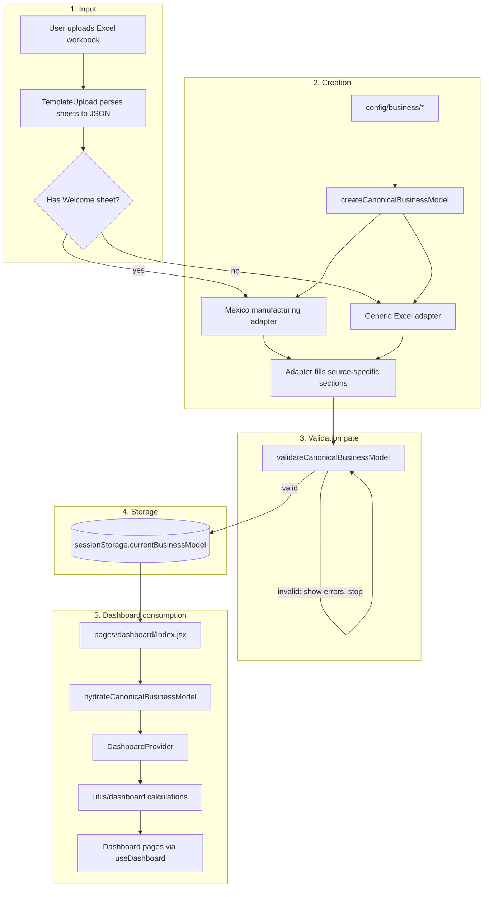
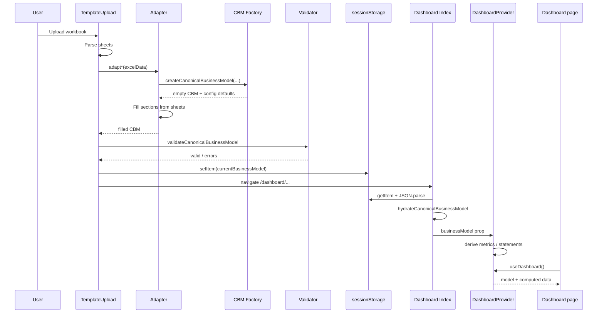

# Canonical Business Model (CBM) Workflow

How business data enters the app, becomes a CBM, is stored, and is consumed by the dashboard.

For folder layout and why MxRep stays isolated, see [`../app_architecture/NEW_PROJECT_STRUCTURE.md`](../app_architecture/NEW_PROJECT_STRUCTURE.md).

## One-sentence version

**Parse input → adapter asks the factory for a blank CBM (with config defaults) → adapter fills it → validate → store → hydrate on load → dashboard context derives metrics → pages render.**

## Important ownership rule

```text
Adapter ──calls──► Factory
Factory does NOT own or import adapters
Config  ──used by──► Factory (defaults only)
```

- **Factory** = “give me a complete, fresh, serializable CBM skeleton.”
- **Adapter** = “translate this Excel (or other source) into filled CBM fields.”
- **Validator** = “reject garbage before we persist or trust the dashboard.”
- **Dashboard** = “hydrate, recalculate, display.” It should not invent a different model shape.

## Diagram (end-to-end)



## Step-by-step

### 1. Input

Entry: `src/pages/TemplateUpload.jsx`

- User picks a filled template.
- SheetJS (`xlsx`) turns the workbook into `{ SheetName: rows[] }`.
- Template type is detected simply: presence of a `Welcome` sheet ⇒ Mexico manufacturing path; otherwise generic Excel path.

### 2. Creation (factory + adapter)

```text
config/business ──► createCanonicalBusinessModel({ source, metadata })
                              │
                              ▼
                    adapter mutates / assigns
                    revenue, boms, premises, …
```

Factory responsibilities:

- Return a **new** object every call (no shared nested arrays/objects).
- Apply identity from options (`source`, country, name, type, …).
- When `metadata.country` matches `config/business/countries.config.js`, seed `countryData`, country premises, and default labor benefits.

Adapter responsibilities:

- Call the factory first (or with known metadata so defaults apply).
- Map sheet cells into CBM sections.
- Run source-specific derivations if needed (Mexico adapter does a lot of this).
- Leave structural completeness to the factory; do not hand-roll a partial anonymous object.

Public API barrel: `@/models/canonical-business-model`

| Function | When |
|----------|------|
| `createCanonicalBusinessModel(options?)` | Start of every adapter |
| `validateCanonicalBusinessModel(model)` | Before persist; also checked in provider |
| `hydrateCanonicalBusinessModel(raw)` | After `JSON.parse` from storage |

### 3. Validation gate

Still in `TemplateUpload` **before** writing storage:

- Failures surface to the user; navigation does not proceed with an invalid model.
- Manufacturing checks look at real paths: `boms.products`, `production.lines` (not outdated `boms.length` / `production.qualityYield`).
- Country is required; timeline lengths should agree when present.

`DashboardContext` validates again when the model is set (defense in depth / stale data).

### 4. Storage

- Key: `sessionStorage['currentBusinessModel']`
- Value: `JSON.stringify(cbm)` — plain object only
- Why sessionStorage: survives the route change to `/dashboard/...` without relying only on React Router location state

Because of stringify/parse, **Date objects become strings**. Hydration normalizes dates and re-applies missing defaults.

### 5. Dashboard consumption

1. `pages/dashboard/Index.jsx` reads props, location state, or sessionStorage.
2. Runs `hydrateCanonicalBusinessModel(parsed)`.
3. Passes the hydrated model into `DashboardProvider`.
4. Provider:
   - keeps the CBM in state
   - validates
   - derives values / statements / cashflow / project metrics via `utils/dashboard/*`
   - exposes everything through `useDashboard()`
5. Pages (`ProjectEvaluation`, `Overview`, `Accounting`, `Forecasts`, `Finances`) **consume context**; they should not re-parse Excel or rebuild the CBM shape.



## Before vs after (what teammates should notice)

| | Before | After |
|---|--------|--------|
| Blank model | Ad-hoc / `createEmptyBusinessModel` mixed with static data | `createCanonicalBusinessModel` only |
| Country defaults | Easy to forget or duplicate | Applied in factory from `config/business` |
| Validation | Weak / wrong field paths | Canonical paths + upload gate |
| Persist → load | Parse and hope | Explicit `hydrateCanonicalBusinessModel` |
| Files | Model + schemas + countries in one area | factory / validators / operations / config / number utils |

The **pipeline stages** (input → adapt → model → validate → store → dashboard) were already the intent. The refactor makes construction, config, and validation **explicit and separated**, not a brand-new product flow.

## Active vs stub adapters

| Adapter | Status |
|---------|--------|
| `excel/mexico-manufacturing.adapter.js` | Active (Welcome sheet) |
| `excel/excel.adapter.js` | Active fallback |
| `custom-excel/custom-excel.adapter.js` | Exported, not wired into upload |
| `mxrep/mxrep.adapter.js` | Exported stub; MxRep UI remains its own island |

## Where to look in code

| Step | File |
|------|------|
| Upload + detect + validate + store | `src/pages/TemplateUpload.jsx` |
| Factory + hydrate | `src/models/canonical-business-model/canonical-business-model.factory.js` |
| Validate | `src/models/canonical-business-model/canonical-business-model.validators.js` |
| Mexico fill | `src/adapters/excel/mexico-manufacturing.adapter.js` |
| Load + hydrate | `src/pages/dashboard/Index.jsx` |
| Consume + calculate | `src/contexts/DashboardContext.jsx` |
| Country / premises defaults | `src/config/business/*.config.js` |
