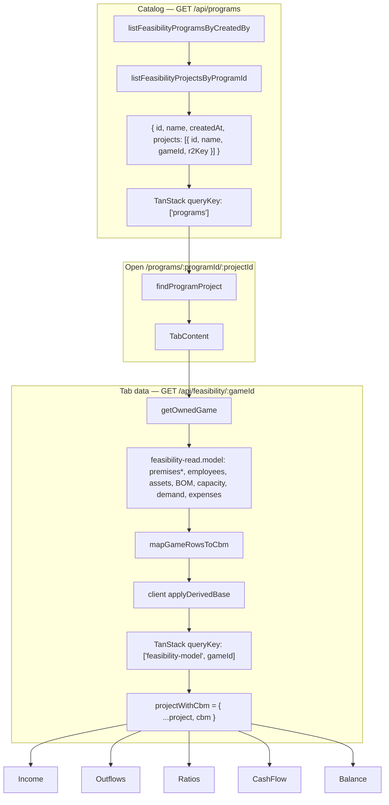
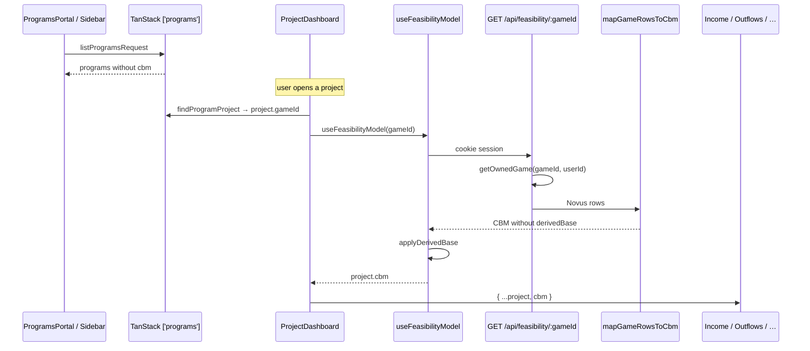

# Project Feasibility — Initial GET Workflow

After upload, the UI does **not** keep the staged CBM. It reloads a thin catalog, then each dashboard tab fetches a rebuilt Excel-shaped CBM from Novus tables.

This fat CBM GET is a compat layer. See `.agents/technical-debt.md`. Do not put `cbm` back on `GET /api/programs`.

## One-sentence version

**`GET /api/programs` returns folder ids + `gameId` → open a project → `GET /api/feasibility/:gameId` rebuilds CBM from D1 → client `applyDerivedBase` → tabs read `project.cbm`.**

## Diagram



## Two payloads

### 1. Catalog (no CBM)

Used by the portal cards, sidebar, and to resolve `:programId/:projectId`.

```text
GET /api/programs
→ [{
    id, name, createdAt, createdBy,
    projects: [{ id, programId, name, gameId, r2Key }]
  }]
```

`r2Key` is the original Excel archive. Tabs do not read it.

### 2. Rebuilt CBM (compat)

```text
GET /api/feasibility/:gameId
→ mapGameRowsToCbm(...)     // metadata.source = 'novus-tables', no derivedBase
→ applyDerivedBase(data)    // same helper as staging; fills derivedBase again
```

| DB | Back onto CBM |
|---|---|
| `games` | `metadata.name`, `timeline.years` from `start_date`/`end_date` |
| `premises` + `_yearly` | rate series (`fxClose`, inflation, ISR, …) |
| `premises_percentage` + `_yearly` | policy % series |
| `premises_deprecations` + `_yearly` | 4 legacy fields + `depreciationByCategory` |
| `expenses` | `services[]` (`monthlyAmount` ← `default_cost`) |
| `assets` + `asset_cost_yearly` | `assets.byCategory` + legacy buckets; `category = machine` → `capacity.machines` with `operators: 0` |
| `employees` + compensation + `game_team_employees` | `employees[]` (`cantidad` from link quantity; `job_title` → type) |
| `boms` + `required_materials` | `bom.productName`, `salePrice`, `parts[]` |
| `capacity` + `production_lines` | line params; `productionLines` hardcoded **1**, `monthsWorkingWeeks` hardcoded **4** |
| `purchase_order_yearly_total` + monthly % | `yearZeroTotal`, `monthShares`; **monthly orders rebuilt as `total × share`** |

Then `applyDerivedBase` recomputes BOM cost, year-0 CO sum, capacity, classified employees — from this rebuilt base, not from a stored blob.

## Sequence



## Where to look

| Step | File |
|------|------|
| Catalog client | `src/sims/project-feasibility/api/programs.api.js` (`listProgramsRequest`) |
| Catalog cache | `src/sims/project-feasibility/pages/ProgramsContext.jsx` |
| Dashboard | `src/sims/project-feasibility/pages/ProjectDashboard.jsx` |
| Tab hook | `src/hooks/sims/project/useFeasibilityModel.js` |
| Client GET + derive | `src/api/sims/feasibility/getFeasibilityModel.service.js` |
| Route | `worker/src/routes/feasibility.route.js` |
| Read + rebuild | `worker/src/services/feasibility-model.service.js` |
| Row → CBM | `worker/src/mappers/game-to-cbm.mapper.js` |
