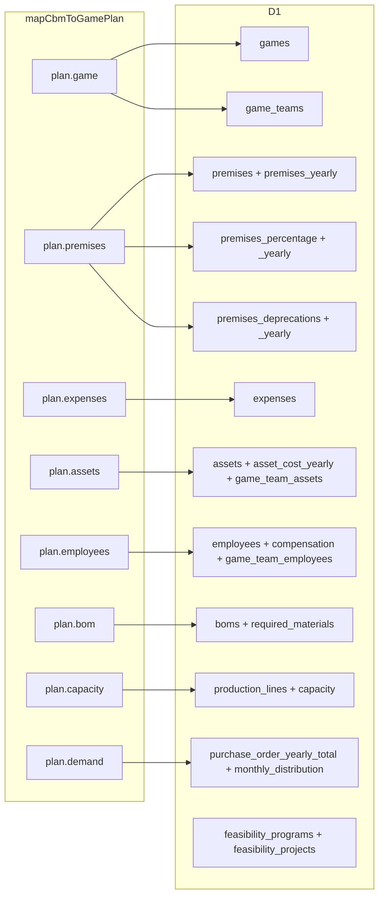
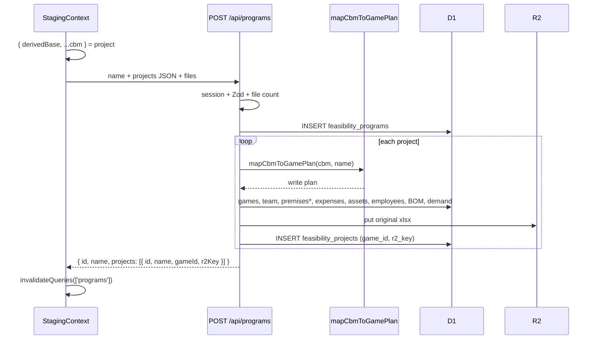

# Project Feasibility — POST Workflow

Confirm on the New Program page sends parsed CBM JSON plus the original Excel files. The worker never opens Excel. It flattens each CBM into Novus table rows and archives the workbook in R2.

## One-sentence version

**Strip `derivedBase` → multipart `POST /api/programs` → `mapCbmToGamePlan` → insert `games` / team / premises / expenses / assets / employees / BOM / demand → put Excel in R2 → insert `feasibility_projects` (`game_id`, `r2_key`).**

## Diagram

```mermaid
flowchart TB
  subgraph CLIENT["Browser"]
    strip["Strip derivedBase from each staged project"]
    form["FormData: name, projects JSON, files"]
    post["POST /api/programs cookie session"]
  end

  subgraph WORKER["Worker"]
    session[sessionMiddleware]
    zod[createProgramRequestSchema]
    files{file count = project count?}
    classId[find-or-create class "Project Feasibility"]
    program[INSERT feasibility_programs]
    map[mapCbmToGamePlan]
    persist[persistGameFromPlan]
    r2["R2 put feasibility/{userId}/{programId}/{gameId}/{file}"]
    child[INSERT feasibility_projects]
    fail[on error: delete program, games, R2 keys]
  end

  strip --> form --> post --> session --> zod --> files
  files -->|mismatch| err400[400 file_count_mismatch]
  files -->|ok| classId --> program --> map --> persist --> r2 --> child
  persist --> fail
  r2 --> fail
```

## Payload vs flattened plan

Client POST body (logical):

```text
{
  name: "Program name",
  projects: [{ name, cbm }],   // CBM without derivedBase
  files:   [File, ...]         // same order as projects
}
```

`mapCbmToGamePlan(cbm, name)` is a **write plan**, not stored as JSON. `persistGameFromPlan` explodes it:



| Plan field | Tables | How |
|---|---|---|
| `game.name / startYear / endYear` | `games` | `start_date` / `end_date` are year strings; `class_id` is the Feasibility class |
| *(per game)* | `game_teams` | one `"Default"` team, `capital = 0` |
| `premises.*` first finite + `game.periods` | `premises` | scalar snapshot of rates; `starting_money = 0` |
| `premises` policy % first finite | `premises_percentage` | inventory, suppliers, ST liability, cost %, sales, admin |
| `premises.yearly[]` | `premises_yearly`, `premises_percentage_yearly` | one row per year 2025–2035 |
| `premises.depreciationCategories[]` | `premises_deprecations`, `_yearly` | one category row + yearly rates |
| `expenses[]` (from CBM `services`) | `expenses` | `default_cost = monthlyAmount`, `expense_type = 'fixed'` |
| `assets[]` | `assets`, `asset_cost_yearly`, `game_team_assets` | Inversion categories + Capacidad machines (`category = 'machine'`); yearly cost only if nonzero; year = `2025 + index` |
| `employees[]` | `employees`, `employee_compensation_items`, `game_team_employees` | `job_title` stores category/type; `cantidad` empty → `1` |
| `bom` | `boms`, `required_materials` | product + parts |
| `capacity` | `production_lines`, `capacity` | one line `line-1`; `capacity.production_lines` is the **line id**, not the CBM count |
| `demand` | `purchase_order_yearly_total`, `purchase_order_monthly_distribution` | year-0 total + 12 month % |
| original `File` | R2 + `feasibility_projects.r2_key` | key `feasibility/{userId}/{programId}/{gameId}/{filename}` |
| program / project names | `feasibility_programs`, `feasibility_projects` | catalog only: `name`, `game_id`, `r2_key` — **no `cbm_json`** |

Not stored from the client CBM: `derivedBase`, monthly `demand.yearZeroOrders[]` (only total + shares), `demand.history`, `capacity.line.monthsWorkingWeeks`, machine `operators`.

Wrangler: `[createProgram] mapCbmToGamePlan flattened plan`, `[createProgram] CBM → D1 table map`, `[createProgram] persisted project`.

## Sequence



## Where to look

| Step | File |
|------|------|
| Strip + POST | `src/sims/project-feasibility/staging/StagingContext.jsx` |
| Axios | `src/sims/project-feasibility/api/programs.api.js` |
| Route | `worker/src/routes/programs.route.js` |
| Controller | `worker/src/controllers/programs.controller.js` |
| Flatten | `worker/src/mappers/cbm-to-game.mapper.js` |
| Orchestrate | `worker/src/services/program.service.js` |
| INSERTs | `worker/src/models/project-write.model.js` |
| R2 key | `worker/src/services/r2.service.js` |
