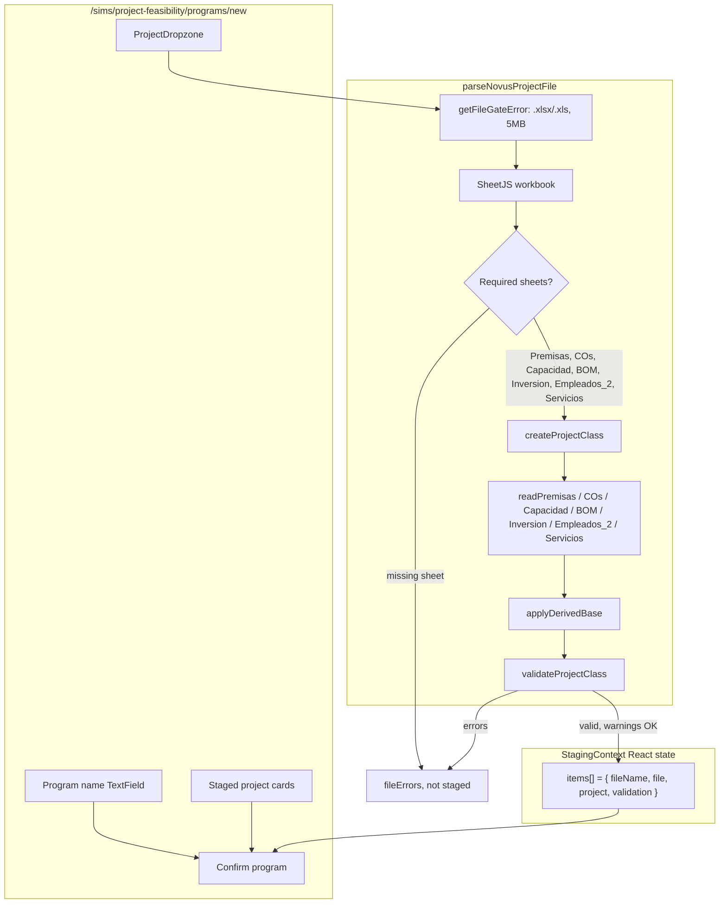
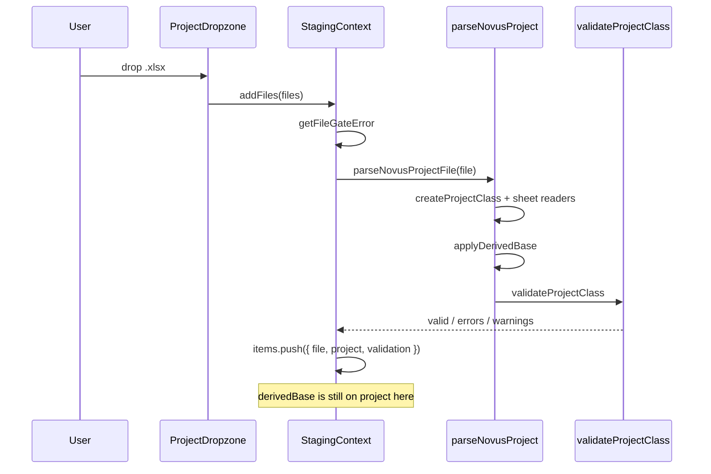

# Project Feasibility — Staging Workflow

Client-only. Excel is parsed in the browser into a Project Class CBM and held in React state until Confirm. Nothing is written to D1 or R2 yet.

This is **not** [`CBM_WORKFLOW.md`](./CBM_WORKFLOW.md) (`/modules/templates/upload` → `sessionStorage`).

## One-sentence version

**Drop InputNovus workbooks → gate files → SheetJS parse required sheets → fill `createProjectClass` → `applyDerivedBase` → validate → keep `{ file, project }` in `StagingContext`.**

## Diagram

## What the staged CBM looks like

`createProjectClass()` is the skeleton. Sheet readers fill it. `applyDerivedBase` then adds a **computed** `derivedBase` block that is **not** posted (see POST diagram).

| Section | Source sheet | Typical contents |
|---|---|---|
| `metadata` | BOM product name + file name | `source: 'novus-excel'` |
| `timeline` | hardcoded 2025–2035 + Premisas `periodos` | `years`, `financingPeriods` |
| `premises` | Premisas | 11-year series (FX, rates, inflation, policy %, depreciation) |
| `demand` | COs | 12 `monthShares`, 12 `yearZeroOrders`, `yearZeroTotal`, optional `history` |
| `capacity` | Capacidad | line params + `machines[]` |
| `bom` | BOM | `productName`, `salePrice`, `parts[]` |
| `assets` | Inversion | `transport` / `buildings` / `compute` plus `byCategory` |
| `employees` | Empleados_2 | name, type, `cantidad`, `percepcion`, benefit %s |
| `services` | Servicios | category, subcategory, `monthlyAmount` |
| `derivedBase` | computed, not Excel | BOM cost, year-0 CO sum, operator/supervisor counts, classified employees, capacity |

DevTools: look for `[Staging] staged project CBM (client, before POST)`.

## Sequence

## Where to look

| Step | File |
|------|------|
| Page | `src/sims/project-feasibility/pages/NewProgram.jsx` |
| Dropzone | `src/sims/project-feasibility/pages/ProjectDropzone.jsx` |
| State | `src/sims/project-feasibility/staging/StagingContext.jsx` |
| Parse | `src/sims/project-feasibility/parse/parseNovusProject.js` |
| Sheet maps | `src/sims/project-feasibility/parse/sheets.js` |
| Skeleton | `src/sims/project-feasibility/model/createProjectClass.js` |
| Derived | `src/sims/project-feasibility/model/applyDerivedBase.js` |
| Validate | `src/sims/project-feasibility/model/validateProjectClass.js` |
