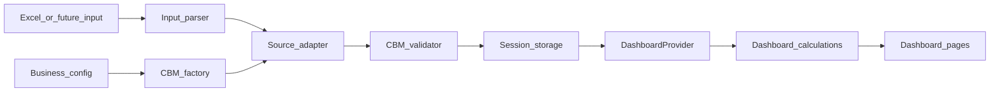

# CBM Factory Refactor

## Target data flow

A factory is simply the one approved function for constructing a fresh CBM. It guarantees that every adapter starts with the same shape and fresh arrays/objects without introducing class instances or prototypes.



Concrete runtime sequence:

1. [`TemplateUpload.jsx`](TecBooks_V2/src/pages/modules/templates/TemplateUpload.jsx) parses the workbook and selects the existing generic or Mexico adapter.
2. The selected adapter calls `createCanonicalBusinessModel({ source, metadata })` instead of constructing an anonymous “empty” object and then separately assigning identity fields.
3. The adapter fills source-specific sections only; all structural defaults come from the factory.
4. `validateCanonicalBusinessModel()` checks the actual canonical paths (`boms.products`, `production.lines`, timeline lengths, finite numbers) before persistence.
5. The model remains a plain JSON-safe object for `sessionStorage`; `hydrateCanonicalBusinessModel()` rebuilds missing defaults and normalizes persisted values when the dashboard loads it.
6. [`DashboardContext.jsx`](TecBooks_V2/src/contexts/DashboardContext.jsx) validates the hydrated CBM, derives metrics/statements/cashflow, and exposes them through `useDashboard()` as it does today.

This refactor will not add an adapter registry, merge the parallel recalculation paths, connect MxRep/custom-excel adapters, or redesign dashboard calculations yet.

## Proposed file structure

```text
src/
  config/
    business/
      countries.config.js
      premises.config.js
      employee-benefits.config.js
      forecasting-methods.config.js
    sims/
      forecasts/
        options.config.js
  models/
    canonical-business-model/
      canonical-business-model.factory.js
      canonical-business-model.validators.js
      canonical-business-model.operations.js
      index.js
  utils/
    number.utils.js
```

Naming rules:

- Non-React modules use kebab-case.
- Role-specific modules use suffixes such as `.factory.js`, `.validators.js`, `.operations.js`, and `.config.js`.
- Exported functions remain camelCase: `createCanonicalBusinessModel`, `hydrateCanonicalBusinessModel`, and `validateCanonicalBusinessModel`.
- The CBM remains a plain serializable object; do not introduce a class because session serialization, adapter mutation, React immutable updates, and object spreading currently depend on plain objects.

## 1. Establish the CBM factory

- Replace [`BusinessModel.js`](TecBooks_V2/src/models/dashboard/BusinessModel.js) with `models/canonical-business-model/canonical-business-model.factory.js`.
- Rename `createEmptyBusinessModel()` to `createCanonicalBusinessModel(options)` and make it responsible for:
  - Returning a fresh complete canonical shape on every call.
  - Applying identity fields supplied by the adapter (`source`, name, type, country, start date).
  - Applying declared country/business defaults from configuration without shared mutable references.
- Add `hydrateCanonicalBusinessModel(rawModel)` for data loaded from session storage. It will explicitly merge canonical sections and normalize serialized dates instead of relying on a shallow spread.
- Update all four adapters to import the factory through `@/models/canonical-business-model`.
- Preserve field names and current calculation behavior unless a field is demonstrably inconsistent with the canonical contract.

## 2. Separate validation, operations, and numeric helpers

- Move `validateBusinessModel()` and the section validators from [`schemas.js`](TecBooks_V2/src/models/dashboard/schemas.js) into `canonical-business-model.validators.js`.
- Rename the public validator to `validateCanonicalBusinessModel()` and correct its existing shape mistakes:
  - Validate `boms.products`, not `boms.length`.
  - Validate `production.lines`, not `production.qualityYield`.
  - Verify timeline `months`, `periods`, and `totalMonths` agree.
  - Verify required period arrays contain finite numbers.
- Move `mergeAdditionalData()` and `getModelSummary()` into `canonical-business-model.operations.js`; remove the unused duplicate summary helper from the Mexico adapter.
- Move generic numeric functions (`sanitizeNumber`, number predicates, array sanitization) into `utils/number.utils.js`; update adapters and dashboard calculation imports.
- Remove unused validator exports rather than retaining a misleading `schemas.js` compatibility layer. Keep a single `models/canonical-business-model/index.js` public barrel.

## 3. Reclassify static data as configuration

- Move the current country, premise, employee-benefit, and forecasting-method lookup objects from [`models/dashboard`](TecBooks_V2/src/models/dashboard) into `config/business/` using the `.config.js` names above.
- Have the factory import configuration directly; adapters should not know where country defaults live.
- Reconcile configuration before applying it:
  - Remove duplicate keys in premises and employee benefits.
  - Keep only forecasting methods that are intentionally supported, while preserving current UI behavior.
  - Do not silently replace legitimate zero values with defaults; use nullish checks rather than `||`.
- Move [`options-configs.js`](TecBooks_V2/src/utils/sims/forecasts/options-configs.js) to `config/sims/forecasts/options.config.js` and update simulator store, component, and hook imports. This is configuration, not calculation logic.

## 4. Update adapters and persistence boundary

- Update the generic Excel, Mexico manufacturing, custom-excel, and MxRep adapters to call the new factory and numeric helpers.
- Keep generic Excel and Mexico manufacturing as the only active upload paths; preserve the other two as exported but currently unwired adapters.
- In [`TemplateUpload.jsx`](TecBooks_V2/src/pages/modules/templates/TemplateUpload.jsx), validate adapter output before storing it and display the validation failure rather than navigating with an invalid CBM.
- In [`pages/dashboard/Index.jsx`](TecBooks_V2/src/pages/dashboard/Index.jsx), hydrate parsed session data before passing it to `DashboardProvider`.
- Update [`DashboardContext.jsx`](TecBooks_V2/src/contexts/DashboardContext.jsx) to call the renamed validator through the model barrel.
- Remove `models/dashboard/` after all runtime imports point to the new modules. Leave the forecast `__tests__` folder in its current location for now, as requested.

## 5. Verify behavior and contract

- Verify each factory call returns independent nested objects and arrays.
- Verify active adapter output passes the canonical validator and survives JSON serialize → parse → hydrate without changing calculations.
- Verify malformed adapter output fails before session persistence.
- Search for stale imports of `models/dashboard`, `BusinessModel`, `schemas`, and `options-configs`.
- Run the existing forecast tests, scoped lint checks, and a production build with the established larger Node heap.
- Smoke-check template upload followed by Project Evaluation, Overview, Accounting, Forecasts, and Finances.

The existing `models/dashboard/test.md` fixture will not be reorganized as part of this pass; test-folder consolidation remains deferred.